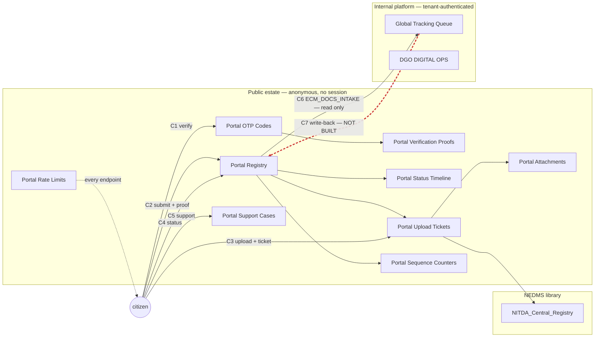

# Portal circles — the loops end to end

Seven loops. **Six are designed and one is not built at all** — and the one that is missing is
the one that closes back to the citizen.

Machine-readable: [`portal-circles.json`](./portal-circles.json). Which flow performs which
operation: [`portal-wiring.json`](./portal-wiring.json). What each list holds:
[`portal-field-spec.json`](./portal-field-spec.json).

---

## The shape of the whole thing

The dashed red edge is the whole finding: **everything flows outward from the citizen and
nothing flows back.**

---

## C1 · Verification

**Who starts it:** an anonymous citizen with an email address.
**Join key:** `Portal OTP Codes.Title` = the lower-cased email. `Portal Verification Proofs.Title` = the opaque proof token.

| # | Flow | Does | Touches |
|---|---|---|---|
| 1 | `VERIFY` | Bucket the caller | Rate Limits r/u/c |
| 2 | `VERIFY` | Supersede any live code for this address, mint one | OTP Codes r/u/c |
| 3 | `VERIFY` | Mail the code, record the send | Outbox Receipts create — **unwired** |
| 4 | `VERIFY_CONFIRM` | Read the latest unconsumed code for the address | OTP Codes read |
| 5 | `VERIFY_CONFIRM` | Expired, exhausted or wrong → consume or increment. Right → consume | OTP Codes update |
| 6 | `VERIFY_CONFIRM` | Mint the single-use proof | Verification Proofs create |

**Closes when** the proof is consumed by C2 or C4, or expires. Terminal states: consumed,
expired, attempts exceeded.

**Today it runs against the wrong estate.** Both flows read and write `OTP_Transactions` on the
internal operations site, so a citizen's one-time codes share a list with staff sign-in. There
is no attempt counter, so the code has no cap. `docs/deployment/sharepoint/remediation/01-otp-estate-split.json`
is the action-by-action fix.

---

## C2 · Submission

**Who starts it:** an anonymous citizen holding a proof from C1.
**Join key:** `Portal Registry.Title` = the minted reference. Every child row carries it as `SubmissionRef`.

| # | Does | Touches |
|---|---|---|
| 1 | Bucket the caller | Rate Limits r/u/c |
| 2 | Redeem the verification proof exactly once | Verification Proofs r/u |
| 3 | Create the registry row, `Title` = `PENDING` until minted | Registry create |
| 4 | Take the next number for the year, under optimistic concurrency | Sequence Counters r/c/u |
| 5 | Patch the minted reference back onto the row | Registry update |
| 6 | Append the first public timeline event | Status Timeline create |
| 7 | Issue one ticket per declared attachment | Upload Tickets create |

**Closes when** the reference is returned and every issued ticket is redeemed (C3) or expires.

Step 4 is the only place in the estate needing concurrency control: two submissions in the same
second must not take the same number. `Portal Sequence Counters` carries `LockToken` and
`ModifiedByFlowRun` for exactly that, which is why it was the one list already complete at 7/7.

---

## C3 · Upload

**Who starts it:** an anonymous citizen holding a ticket from C2.
**Join key:** `Portal Upload Tickets.Title` = the opaque ticket; `SubmissionRef` joins back to the registry.

| # | Does | Touches |
|---|---|---|
| 1 | Bucket the caller | Rate Limits r/u/c |
| 2 | Read the ticket — expired or already redeemed stops here | Upload Tickets read |
| 3 | Store the bytes | **`NITDA_Central_Registry`** — the one sanctioned write outside the estate |
| 4 | Record the stored attachment | Attachments create |
| 5 | Mark the ticket redeemed | Upload Tickets update |

**Closes** on redemption. A ticket is single-use by construction: the read in step 2 and the
update in step 5 are what make it so, and skipping either turns the ticket into a reusable
upload credential.

A library holds files, a list holds metadata. That is why step 3 leaves the estate and why no
other step may.

---

## C4 · Status

**Who starts it:** an anonymous citizen with a reference, an email and a proof.
**Join key:** reference **and** `SenderEmail` must both match.

| # | Does | Touches |
|---|---|---|
| 1 | Bucket by source **and** by reference | Rate Limits r/u/c |
| 2 | Redeem the verification proof | Verification Proofs r/u |
| 3 | Read the row, matching the resolved address | Registry read |
| 4 | Read the public timeline | Status Timeline read |

**Closes** read-only — leaves nothing behind but the consumed proof.

Two buckets, not one: per source stops a scraper, per reference stops someone hammering a
single reference they have guessed. A reference is guessable by construction — it is
`NITDA-<year>-<n>` — so the email match and the proof are what actually protect the row.

---

## C5 · Support

**Who starts it:** anyone. No proof required.
**Join key:** `Portal Support Cases.Title` = `NITDA-S-XXXXXX`. `AboutReference` optionally points at a registry reference.

| # | Does | Touches |
|---|---|---|
| 1 | Bucket the caller | Rate Limits r/u/c |
| 2 | Create the case | Support Cases create |
| 3 | Mail the acknowledgement, record the send | Outbox Receipts create — **unwired** |

**Closes** with a case reference. **Never enters the registry** — a case is not correspondence,
and letting a helpdesk message become a registered submission is how a registry stops meaning
anything.

---

## C6 · Intake — the crossing

**Who starts it:** the internal platform, tenant-authenticated.
**Flow:** `ECM_DOCS_INTAKE` (the design's `09-portal-intake-feed`). **Built and correct.**

| # | Does | Touches |
|---|---|---|
| 1 | Read the registry, newest first, top 5000 | Registry read |
| 2 | Project 22 columns for the internal platform | — |

This is **the only crossing** between the public estate and the internal platform, and it holds
the boundary three ways: it is tenant-authenticated so no anonymous caller reaches it, it is
read-only so nothing internal can be written from the portal side, and it projects a fixed
column set so a column added to the registry does not silently become an internal field.

It projects `ReferenceId` three ways — `Reference_ID`, `RefIDD`, `ReferenceId` — because the
internal normalisers read it under all three aliases.

---

## C7 · Triage write-back — **the open circle**

**Who would start it:** an internal registry officer changing an item's state.
**Flow:** none. Not deployed, not in the `01-09` design, not behind any contract key.

| # | Would do | Would touch |
|---|---|---|
| 1 | On an internal status change, patch the registry row | Registry update — **no writer exists** |
| 2 | Append the corresponding public timeline event | Status Timeline create — **no writer exists** |

**It does not close.**

A citizen calling `STATUS` can only ever be told what `SUBMISSION` wrote at the moment of
submission. Acknowledgement, review, action-required and closure are invisible to them however
far the item progresses internally.

This is not an oversight discovered here so much as one recorded and never assigned. The
original field specification annotates `AcknowledgedAtUtc` as *"Never written by these six flows
— populated by internal triage; STATUS reports it once filled in"* and `ClosedAtUtc` as *"Same
— not written here."* Something was always expected to fill them. No artifact in this
repository names what.

**Decided — see [`DECISIONS.md` § D1](./DECISIONS.md).** C7 is a second branch on
`ECM_DOCS_INTAKE`, selected by a top-level `action`, invoked by the internal platform when it
changes a portal item's state. Not a new flow and not a SharePoint trigger — there is nothing
to trigger on, because `ECM_DOCS_INTAKE` is a live read feed rather than a copy and no flow in
the estate creates an internal row from portal data. C6 reads outward, C7 writes back, both
tenant-authenticated, and the crossing count stays at one.

Until it exists, six of the seven governed status values — `validation`, `review`,
`action-required`, `approved`, `declined`, `withdrawn` — can never be shown to a citizen. Only
`received` can.

---

## What holds all this together

| Relationship | Key | Where it is checked |
|---|---|---|
| Registry → timeline, tickets, attachments | `ReferenceId`, carried as `SubmissionRef` | `npm run test:wiringspec` |
| Registry → internal activity | `ReferenceId`, projected as three aliases by C6 | `npm run test:flowmap` |
| Ticket → stored file | `StoredName` under the Universal Filename Policy | `npm run test:filenames` |
| Proof → the endpoint that redeems it | opaque token in `Title`, single use | `npm run wiring` |
| Status values shown to a citizen | the governed vocabulary, both platforms | `npm run test:statuses` |
| Public estate ↔ internal estate | one crossing, C6, read-only | `npm run wiring` (boundary) |
| Public estate ↔ governance estate | none, in either direction | `npm run wiring` (boundary) |

**The trust boundary in one sentence:** everything a stranger can invoke touches the twelve
portal lists and nothing else; C6 is the only door, it opens one way, and it needs a tenant
identity to open at all.
