# 8. Process hierarchy

> **Generated.** Produced by `scripts/process-docs.mjs` from `docs/reference/process-inventory.json`,
> which `scripts/process-discovery.mjs` builds by reading the artifacts in this repository.
> Do not edit this file: edit the artifact, or the script that reads it, and regenerate.
> Inventory generated 2026-09-11. Standard `dgo-process-documentation/v2`.

**Purpose.** Place every process and subprocess under a parent, so nothing floats unattached.

## Hierarchy by group

### START HERE — 2 process(es)

- **PROC-001** Command Center
- **PROC-002** ERP–ECM Charter

### OPERATIONS — 7 process(es)

- **PROC-003** Activities
  - _SUBPROC-052_ Save the work state (Reusable governed write)
  - _SUBPROC-057_ Mark the document (Reusable governed write)
  - _SUBPROC-064_ Archive the activity (Reusable governed write)
  - _SUBPROC-065_ Route the activity to SIWES (Reusable governed write)
  - _SUBPROC-066_ Route the activity to NYSC (Reusable governed write)
  - ~VAR-005~ variant: mark the document — raised from lookup
- **PROC-004** Intake & Assignment
  - _SUBPROC-001_ Assignment Desk (Sub-view of a primary workspace)
  - _SUBPROC-002_ Bulk Assignment (Sub-view of a primary workspace)
  - _SUBPROC-007_ Log the correspondence (Reusable governed write)
  - _SUBPROC-017_ Update the record (Reusable governed write)
  - _SUBPROC-060_ Turn the email into a correspondence record (Reusable governed write)
  - ~VAR-001~ variant: log the correspondence — raised from scan-intake
- **PROC-005** My Work
  - _SUBPROC-022_ Start work on that task (Reusable governed write)
  - _SUBPROC-023_ Mark that work complete (Reusable governed write)
  - _SUBPROC-053_ Set the reminder (Reusable governed write)
  - _SUBPROC-058_ Update the task (Reusable governed write)
  - ~VAR-006~ variant: update the task — raised from lookup
  - ~VAR-014~ variant: Support request — Timeline / Due Date Issue
- **PROC-006** Acknowledgment Queue
  - _SUBPROC-020_ Record the acknowledgment (Reusable governed write)
  - _SUBPROC-021_ Send the acknowledgments still waiting (Reusable governed write)
  - _SUBPROC-046_ Send the reminder (Reusable governed write)
  - ~VAR-002~ variant: record the acknowledgment — raised from orchestrator
  - ~VAR-018~ variant: Support request — Already Acknowledged
- **PROC-007** Registry
  - _SUBPROC-003_ Registry Scan Intake (Sub-view of a primary workspace)
  - _SUBPROC-047_ Register the file (Reusable governed write)
  - _SUBPROC-048_ Route the file (Reusable governed write)
  - _SUBPROC-049_ Record receipt of the file (Reusable governed write)
  - _SUBPROC-050_ Close the file (Reusable governed write)
- **PROC-008** Comments
  - _SUBPROC-045_ Add the comment (Reusable governed write)
  - ~VAR-015~ variant: Support request — Clarification Required
- **PROC-009** Lookup & Direct Action
  - ~VAR-017~ variant: Support request — Wrong Task or Reference

### CONTROL — 9 process(es)

- **PROC-010** Tracking & Monitoring
- **PROC-011** FastTrack SLA
  - _SUBPROC-063_ Resolve the escalation (Reusable governed write)
- **PROC-012** Review & Approval
  - _SUBPROC-024_ Record the approval (Reusable governed write)
  - _SUBPROC-039_ Raise the approval request (Reusable governed write)
  - _SUBPROC-040_ Record the rejection (Reusable governed write)
- **PROC-013** Briefs & Submissions
  - _SUBPROC-008_ Create the brief (Reusable governed write)
  - _SUBPROC-009_ Submit the brief (Reusable governed write)
  - _SUBPROC-010_ Record the decision on the brief (Reusable governed write)
- **PROC-014** Meetings
  - _SUBPROC-011_ Request the meeting (Reusable governed write)
  - _SUBPROC-012_ Record the decision on the meeting (Reusable governed write)
  - _SUBPROC-013_ Turn the meeting actions into tasks (Reusable governed write)
- **PROC-015** Projects
  - _SUBPROC-014_ Create the project (Reusable governed write)
  - _SUBPROC-015_ Update the project (Reusable governed write)
- **PROC-016** Reports
  - _SUBPROC-028_ Produce the report (Reusable governed write)
- **PROC-017** Statistics
- **PROC-018** DGCEO Correspondence & Decision Hub
  - _SUBPROC-025_ Record the executive approval (Reusable governed write)
  - _SUBPROC-041_ Return the item to the sender (Reusable governed write)
  - _SUBPROC-042_ Delegate the item (Reusable governed write)
  - _SUBPROC-043_ Add the minute (Reusable governed write)
  - ~VAR-009~ variant: Executive decision hub — as DGCEO
  - ~VAR-010~ variant: Executive decision hub — as Officer
  - ~VAR-011~ variant: Executive decision hub — as EA

### CLOSURE — 2 process(es)

- **PROC-019** Dispatch
  - _SUBPROC-004_ Archive Evidence (Sub-view of a primary workspace)
  - _SUBPROC-026_ Send the dispatch (Reusable governed write)
  - _SUBPROC-054_ Record that nothing will be dispatched (Reusable governed write)
  - _SUBPROC-055_ Send the dispatch again (Reusable governed write)
  - _SUBPROC-056_ Close the dispatch (Reusable governed write)
- **PROC-020** Correspondence Email Desk
  - _SUBPROC-030_ Save the letter draft (Reusable governed write)
  - _SUBPROC-031_ Send the letter (Reusable governed write)
  - _SUBPROC-032_ Duplicate the letter draft (Reusable governed write)
  - _SUBPROC-033_ Archive the letter (Reusable governed write)

### SYSTEM — 5 process(es)

- **PROC-021** Assistant
  - ~VAR-012~ variant: Support request — Access Error
- **PROC-022** Admin Suite
- **PROC-023** Operator HUD
- **PROC-024** Administration
  - _SUBPROC-005_ User Administration (Sub-view of a primary workspace)
  - _SUBPROC-006_ Endpoint Console (Sub-view of a primary workspace)
  - _SUBPROC-034_ Save your profile (Reusable governed write)
  - _SUBPROC-067_ Import that file (Reusable governed write)
- **PROC-025** System Health
  - _SUBPROC-029_ Run the system checks (Reusable governed write)
  - ~VAR-016~ variant: Support request — Offline / Queue Issue

### Flow estate — 77 process(es)

- **PROC-026** 01 - Fetch_All_Data
- **PROC-027** 01 - Fetch_References_and_Lookups_Data - POST
- **PROC-028** 01 - GOV - Provision HTTP Flow Registry
- **PROC-029** 01-Fetch_Docs_POST
- **PROC-030** 02 - Fetch_References_and_Lookups_Data - POST
- **PROC-031** 02 - GOV - Register HTTP Flow Truth
- **PROC-032** 02- Fetch_All_Data
- **PROC-033** 02-Fetch_Docs_POST
- **PROC-034** 03 - Fetch_All_Data
- **PROC-035** 03 - GOV - Record HTTP Flow Execution
- **PROC-036** 04 - GOV - Audit HTTP Flow Registry Flow Update
- **PROC-037** 05 - GOV - Retire HTTP Flow
- **PROC-038** 06 - GOV - Registry Exception
- **PROC-039** 07 - GOV - Consumer HTTP Self-Registration Template
- **PROC-040** 08 - GOV - Discover and Register HTTP Consumers
- **PROC-041** AUTO_SCHEDULED_SWEEP
- **PROC-042** Bulk Assign Direct
- **PROC-043** CG_SEND_EMAIL
- **PROC-044** CG_Status_Check_Endpoint
- **PROC-045** CG_Submission_Endpoint
- **PROC-046** CG_Support_Endpoint
- **PROC-047** CG_Upload_Endpoint
- **PROC-048** CG_Verification_Confirmation_Endpoint
- **PROC-049** CG_Verification_Endpoint
- **PROC-050** CG_Writeback_Endpoint
- **PROC-051** DGO_AI_Assist
- **PROC-052** DGSO INCOMING AI PROCESSING
- **PROC-053** Deployed - Create Task
- **PROC-054** Deployed Bulk Task Assignment_Create Task
- **PROC-055** Digital Hub Email AI Assist
- **PROC-056** ECM_DOCS_INTAKE
- **PROC-057** ECM_EDM_ARCHIVE
- **PROC-058** FETCH_DOCS_V2_POST
- **PROC-059** Fetch Activities
- **PROC-060** Fetch_Emails_HTTP_POST
- **PROC-061** Fetch_Emails_POST
- **PROC-062** Fetch_Tasks_POST
- **PROC-063** Get Correspondences
- **PROC-064** Get Docs HTTP
- **PROC-065** Get Email Attachments
- **PROC-066** Get Emails HTTP
- **PROC-067** Get Selected Activities and Tasks
- **PROC-068** Get Tasks HTTP
- **PROC-069** GetDocsPaginatedData
- **PROC-070** Global_Gap_Remediation_Provisioning
- **PROC-071** IP_OTP_Endpoint
- **PROC-072** IP_OTP_VERIFY
- **PROC-073** IP_SCAN_INTAKE
- **PROC-074** Instant OpenRouter AI Chat
- **PROC-075** OPS_REFERENCES_AND_LOOKUPS
- **PROC-076** Persistent GPT AI Chat in App
- **PROC-077** Portal_Datta_Architecture_Provisioning
- **PROC-078** Portal_ECM_DOCS_STATUS
- **PROC-079** Portal_ECM_DOCS_SUPPORT
- **PROC-080** Portal_Status_Enquiry
- **PROC-081** Portal_UBMISSION_ECM_DOCS
- **PROC-082** Portal_UPLOAD_ECM_DOCS
- **PROC-083** Portal_Upload_HTTP
- **PROC-084** Portal_Verify_Confirm
- **PROC-085** Portal_Verify
- **PROC-086** Repair the DGO
- **PROC-087** SUBMISSION_ECM_DOCS_PORTAL
- **PROC-088** UPLOAD_ECM_DOCS_PORTAL
- **PROC-089** Universal Dynamic_Multi-Actions_Executor
- **PROC-090** WEB Get Docs  HTTP GET
- **PROC-091** Web - Email AI Assist
- **PROC-092** Web - Email Task Created
- **PROC-093** Web - Email To Task Processing
- **PROC-094** Web - Get Email Attachments
- **PROC-095** Web - Get Tasks GET SWITCH
- **PROC-096** Web - OTP Generate
- **PROC-097** Web - OTP Verify
- **PROC-098** Web - Preprocess user message
- **PROC-099** Web - Send Email
- **PROC-100** Web - Subsidiary Doc Actions
- **PROC-101** Web - Task Update
- **PROC-102** optimized Bulk Assign Direct

## Hierarchy diagram

Groups, their processes and the subprocesses attached to each. Where a group carries more than twelve
processes the diagram shows the first twelve and the list above carries the rest; the diagram is an
aid, the list is the record.

```mermaid
flowchart TD
  G_START_HERE["START HERE"]
  G_START_HERE --> PROC_001["Command Center"]
  G_START_HERE --> PROC_002["ERP–ECM Charter"]
  G_OPERATIONS["OPERATIONS"]
  G_OPERATIONS --> PROC_003["Activities"]
  PROC_003 --> SUBPROC_052("Save the work state")
  PROC_003 --> SUBPROC_057("Mark the document")
  PROC_003 --> SUBPROC_064("Archive the activity")
  PROC_003 --> SUBPROC_065("Route the activity to SIWES")
  PROC_003 --> SUBPROC_066("Route the activity to NYSC")
  G_OPERATIONS --> PROC_004["Intake & Assignment"]
  PROC_004 --> SUBPROC_001("Assignment Desk")
  PROC_004 --> SUBPROC_002("Bulk Assignment")
  PROC_004 --> SUBPROC_007("Log the correspondence")
  PROC_004 --> SUBPROC_017("Update the record")
  PROC_004 --> SUBPROC_060("Turn the email into a correspondence record")
  G_OPERATIONS --> PROC_005["My Work"]
  PROC_005 --> SUBPROC_022("Start work on that task")
  PROC_005 --> SUBPROC_023("Mark that work complete")
  PROC_005 --> SUBPROC_053("Set the reminder")
  PROC_005 --> SUBPROC_058("Update the task")
  G_OPERATIONS --> PROC_006["Acknowledgment Queue"]
  PROC_006 --> SUBPROC_020("Record the acknowledgment")
  PROC_006 --> SUBPROC_021("Send the acknowledgments still waiting")
  PROC_006 --> SUBPROC_046("Send the reminder")
  G_OPERATIONS --> PROC_007["Registry"]
  PROC_007 --> SUBPROC_003("Registry Scan Intake")
  PROC_007 --> SUBPROC_047("Register the file")
  PROC_007 --> SUBPROC_048("Route the file")
  PROC_007 --> SUBPROC_049("Record receipt of the file")
  PROC_007 --> SUBPROC_050("Close the file")
  G_OPERATIONS --> PROC_008["Comments"]
  PROC_008 --> SUBPROC_045("Add the comment")
  G_OPERATIONS --> PROC_009["Lookup & Direct Action"]
  G_CONTROL["CONTROL"]
  G_CONTROL --> PROC_010["Tracking & Monitoring"]
  G_CONTROL --> PROC_011["FastTrack SLA"]
  PROC_011 --> SUBPROC_063("Resolve the escalation")
  G_CONTROL --> PROC_012["Review & Approval"]
  PROC_012 --> SUBPROC_024("Record the approval")
  PROC_012 --> SUBPROC_039("Raise the approval request")
  PROC_012 --> SUBPROC_040("Record the rejection")
  G_CONTROL --> PROC_013["Briefs & Submissions"]
  PROC_013 --> SUBPROC_008("Create the brief")
  PROC_013 --> SUBPROC_009("Submit the brief")
  PROC_013 --> SUBPROC_010("Record the decision on the brief")
  G_CONTROL --> PROC_014["Meetings"]
  PROC_014 --> SUBPROC_011("Request the meeting")
  PROC_014 --> SUBPROC_012("Record the decision on the meeting")
  PROC_014 --> SUBPROC_013("Turn the meeting actions into tasks")
  G_CONTROL --> PROC_015["Projects"]
  PROC_015 --> SUBPROC_014("Create the project")
  PROC_015 --> SUBPROC_015("Update the project")
  G_CONTROL --> PROC_016["Reports"]
  PROC_016 --> SUBPROC_028("Produce the report")
  G_CONTROL --> PROC_017["Statistics"]
  G_CONTROL --> PROC_018["DGCEO Correspondence & Decision Hub"]
  PROC_018 --> SUBPROC_025("Record the executive approval")
  PROC_018 --> SUBPROC_041("Return the item to the sender")
  PROC_018 --> SUBPROC_042("Delegate the item")
  PROC_018 --> SUBPROC_043("Add the minute")
  G_CLOSURE["CLOSURE"]
  G_CLOSURE --> PROC_019["Dispatch"]
  PROC_019 --> SUBPROC_004("Archive Evidence")
  PROC_019 --> SUBPROC_026("Send the dispatch")
  PROC_019 --> SUBPROC_054("Record that nothing will be dispatched")
  PROC_019 --> SUBPROC_055("Send the dispatch again")
  PROC_019 --> SUBPROC_056("Close the dispatch")
  G_CLOSURE --> PROC_020["Correspondence Email Desk"]
  PROC_020 --> SUBPROC_030("Save the letter draft")
  PROC_020 --> SUBPROC_031("Send the letter")
  PROC_020 --> SUBPROC_032("Duplicate the letter draft")
  PROC_020 --> SUBPROC_033("Archive the letter")
  G_SYSTEM["SYSTEM"]
  G_SYSTEM --> PROC_021["Assistant"]
  G_SYSTEM --> PROC_022["Admin Suite"]
  G_SYSTEM --> PROC_023["Operator HUD"]
  G_SYSTEM --> PROC_024["Administration"]
  PROC_024 --> SUBPROC_005("User Administration")
  PROC_024 --> SUBPROC_006("Endpoint Console")
  PROC_024 --> SUBPROC_034("Save your profile")
  PROC_024 --> SUBPROC_067("Import that file")
  G_SYSTEM --> PROC_025["System Health"]
  PROC_025 --> SUBPROC_029("Run the system checks")
  G_Flow_estate["Flow estate"]
  G_Flow_estate --> PROC_026["01 - Fetch_All_Data"]
  G_Flow_estate --> PROC_027["01 - Fetch_References_and_Lookups_Data - POST"]
  G_Flow_estate --> PROC_028["01 - GOV - Provision HTTP Flow Registry"]
  G_Flow_estate --> PROC_029["01-Fetch_Docs_POST"]
  G_Flow_estate --> PROC_030["02 - Fetch_References_and_Lookups_Data - POST"]
  G_Flow_estate --> PROC_031["02 - GOV - Register HTTP Flow Truth"]
  G_Flow_estate --> PROC_032["02- Fetch_All_Data"]
  G_Flow_estate --> PROC_033["02-Fetch_Docs_POST"]
  G_Flow_estate --> PROC_034["03 - Fetch_All_Data"]
  G_Flow_estate --> PROC_035["03 - GOV - Record HTTP Flow Execution"]
  G_Flow_estate --> PROC_036["04 - GOV - Audit HTTP Flow Registry Flow Update"]
  G_Flow_estate --> PROC_037["05 - GOV - Retire HTTP Flow"]
```

**Title.** Process hierarchy. **Purpose.** Show parentage for every process and subprocess.
**Scope.** Processes and subprocesses; no step, rule or status appears. **Legend.** A square node is a
process, a rounded node a subprocess, a plain node a group. **Confirmed / inferred.** Every parentage
shown is declared: a workspace group comes from the workspace configuration, a subprocess parent from
the governance table or the hidden-route declaration.

## Subprocesses with no placed parent

_None. Every subprocess resolves to a process record._
