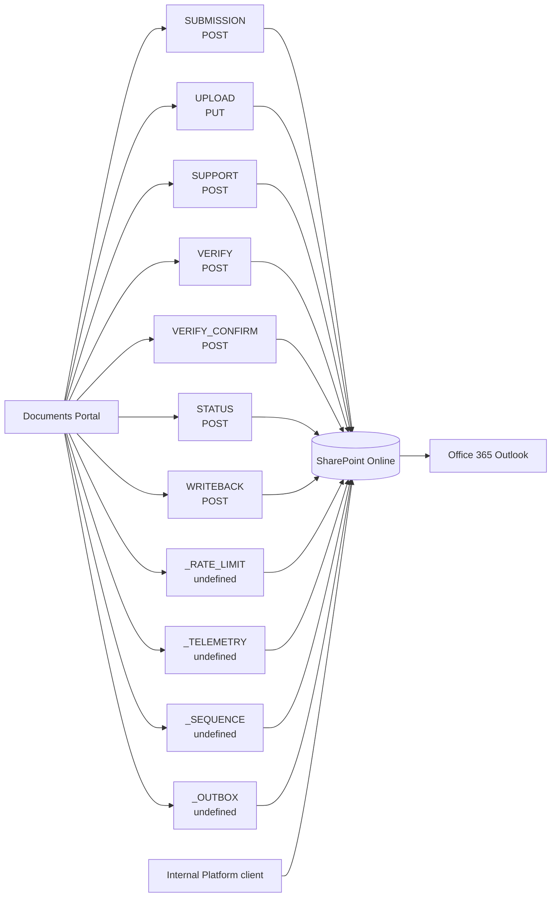

# 15. Integration-supported process catalogue

> **Generated.** Produced by `scripts/process-docs.mjs` from `docs/reference/process-inventory.json`,
> which `scripts/process-discovery.mjs` builds by reading the artifacts in this repository.
> Do not edit this file: edit the artifact, or the script that reads it, and regenerate.
> Inventory generated 2026-09-11. Standard `dgo-process-documentation/v2`.

**Purpose.** Record every published contract and every connector the estate actually calls, and which processes depend on each.

## Published contracts — 11

| ID | Key | Method | Transport | Purpose | Request fields | Required fields | Response fields | Persistence targets | Evidence | Sources |
| --- | --- | --- | --- | --- | --- | --- | --- | --- | --- | --- |
| INT-001 | SUBMISSION | POST | json | Register a correspondence, mint its reference, issue one upload ticket per declared attachment. | 18 | localId channel correspondenceType subject category sender.name senderEmail description submittedAt attachments[].name attachments[].size attachments[].sha256 | 5 | Portal Registry/LocalId Portal Registry/Channel Portal Registry/CorrespondenceType Portal Registry/Subject Portal Registry/Category Portal Registry/SenderName Portal Registry/SenderOrganisation Portal Registry/SenderOrganisationType Portal Registry/SenderEmail Portal Registry/SenderPhone Portal Registry/EventDate Portal Registry/Description Portal Registry/SubmittedAtUtc Portal Registry/AttachmentCount Portal Upload Tickets/DeclaredName Portal Upload Tickets/DeclaredSizeBytes Portal Upload Tickets/DeclaredSha256 Portal Verification Proofs/Consumed | Confirmed | SRC-003 |
| INT-002 | UPLOAD | PUT | raw bytes | Redeem one single-use ticket with the raw file. | 3 | Content-Type X-Upload-Ticket body | 3 | Portal Upload Tickets/Title Portal Attachments/AttachmentLink | Confirmed | SRC-003 |
| INT-003 | SUPPORT | POST | json | Raise a helpdesk case. Never enters the registry. | 5 | name email topic message | 1 | Portal Support Cases/Name Portal Support Cases/Email Portal Support Cases/Topic Portal Support Cases/AboutReference Portal Support Cases/Message | Confirmed | SRC-003 |
| INT-004 | VERIFY | POST | json | Mail a one-time code to an address. | 1 | email | 2 | Portal OTP Codes/Email | Confirmed | SRC-003 |
| INT-005 | VERIFY_CONFIRM | POST | json | Exchange a code for a single-use proof. | 2 | email code | 2 | — | Confirmed | SRC-003 |
| INT-006 | STATUS | POST | json | Read one submission back, in the public projection only. | 3 | referenceId email verification | 16 | — | Confirmed | SRC-003 |
| INT-007 | WRITEBACK | POST | json | A verified citizen responds, adds a note, or withdraws. Appends to the timeline; only withdrawal changes status. | 4 | referenceId verification action body | 3 | — | Confirmed | SRC-003 |
| INT-008 | _RATE_LIMIT | — | — | A fixed 60-minute window counter per endpoint per source. Read, then update or create, before the work. | 0 | — | 1 | — | Confirmed | SRC-003 |
| INT-009 | _TELEMETRY | — | — | One row per run, written inside the capture scope and never on the request path. | 0 | — | 0 | — | Confirmed | SRC-003 |
| INT-010 | _SEQUENCE | — | — | Mint a unique, monotonic reference per year. Replaces the last-three-digits-of-ticks scheme, which yields 1000 values a year and collides. | 0 | — | 0 | — | Confirmed | SRC-003 |
| INT-011 | _OUTBOX | — | — | A receipt that a message was sent. Never the message body, and never a one-time code. | 0 | — | 0 | — | Confirmed | SRC-003 |

## Connectors in use, and the processes that call them

| Connector | Processes calling it | Count |
| --- | --- | --- |
| Microsoft SharePoint Online | PROC-026 PROC-027 PROC-028 PROC-029 PROC-030 PROC-031 PROC-032 PROC-033 PROC-034 PROC-035 PROC-036 PROC-037 PROC-038 PROC-039 PROC-040 PROC-041 PROC-042 PROC-043 PROC-044 PROC-045 PROC-046 PROC-047 PROC-048 PROC-049 | 63 |
| Microsoft Office 365 Outlook | PROC-026 PROC-027 PROC-028 PROC-029 PROC-030 PROC-031 PROC-032 PROC-033 PROC-034 PROC-035 PROC-036 PROC-037 PROC-038 PROC-039 PROC-040 PROC-041 PROC-042 PROC-043 PROC-046 PROC-048 PROC-049 PROC-050 PROC-052 PROC-053 | 58 |
| Microsoft Power Automate Management | PROC-026 PROC-027 PROC-029 PROC-030 PROC-033 PROC-048 PROC-050 PROC-052 PROC-053 PROC-054 PROC-056 PROC-058 PROC-060 PROC-061 PROC-062 PROC-075 PROC-077 PROC-084 PROC-085 PROC-089 PROC-092 PROC-094 PROC-095 PROC-096 | 26 |
| Microsoft OneDrive for Business | PROC-052 | 1 |
| Microsoft Mail (send-only) | PROC-093 | 1 |

## Integration context diagram

**Title.** Integration context. **Purpose.** Show which published contract carries which citizen
interaction into the system of record. **Scope.** Published contracts only; internal endpoint aliases
are in document 16. **Legend.** A rectangle is a contract, a cylinder the system of record.
**Confirmed / inferred.** The contracts and their methods are confirmed from the data contract. The
edge from each contract to SharePoint is **inferred**: the contract declares a persistence target for
its fields, and the architecture states flows are the only mechanism, but no single artifact states
the whole path in one place.
