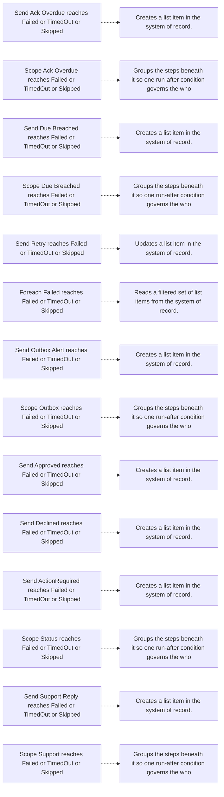
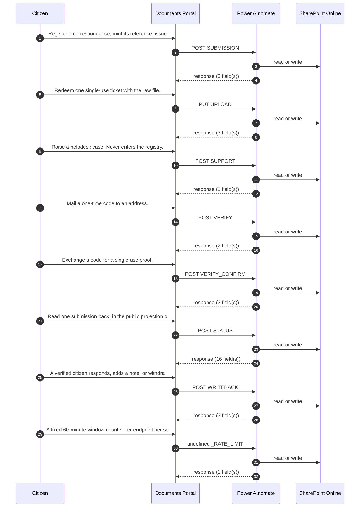

# 20. End-to-end process diagrams

> **Generated.** Produced by `scripts/process-docs.mjs` from `docs/reference/process-inventory.json`,
> which `scripts/process-discovery.mjs` builds by reading the artifacts in this repository.
> Do not edit this file: edit the artifact, or the script that reads it, and regenerate.
> Inventory generated 2026-09-17. Standard `dgo-process-documentation/v2`.

**Purpose.** Draw what the evidence supports and nothing more. Every node on every diagram below carries an identifier used in the written catalogues.

Eight diagram kinds are drawn here. Four the standard asks for are **not** drawn, and the reason is
given at the end rather than substituted with a plausible picture.

---

## Diagram 1 — Process hierarchy

Drawn in [document 8](08-PROCESS-HIERARCHY.md), where it sits beside the list it summarises.

---

## Diagram 2 — Estate context

Drawn in [document 6](06-PROCESS-ARCHITECTURE.md).

---

## Diagram 3 — Integration context

Drawn in [document 15](15-INTEGRATION-CATALOGUE.md).

---

## Diagram 4 — Dependency and handoff map

Drawn in [document 16](16-DEPENDENCY-MAP.md).

---

## Diagram 5 — State transitions

Drawn in [document 14](14-STATUS-AND-TRANSITION-CATALOGUE.md).

---

## Diagram 6 — Swimlane, BPMN-style: AUTO_SCHEDULED_SWEEP

**Title.** AUTO_SCHEDULED_SWEEP — first 28 steps by responsible party.
**Purpose.** Show, for the automated process carrying the most branching and recovery evidence, which
party performs each step. **Scope.** The first 28 of 81
steps; the complete sequence is in [PROC-041](detail/PROC-041.md). **Legend.** Each lane is
a responsible party as recorded on the step; an arrow is a declared run-after edge.
**Confirmed / inferred.** Every node and every edge is confirmed from the workflow definition.

```mermaid
flowchart TD
  subgraph Automated["Automated"]
    STEP_0730["Initialize variable varReceivedAtUtc"]
    STEP_0731["Initialize variable varErrors"]
    STEP_0732["Scope Scheduled Sweep"]
    STEP_0733["Scope Ack Overdue"]
    STEP_0735["Filter Ack Unacknowledged"]
    STEP_0736["Foreach Ack"]
    STEP_0737["Compose Ack Ref"]
    STEP_0738["Compose Ack To"]
    STEP_0740["Compose Already Ack"]
    STEP_0741["Condition Ack Send"]
    STEP_0744["Scope Due Breached"]
    STEP_0746["Filter Due Open"]
    STEP_0747["Foreach Due"]
    STEP_0748["Compose Due Ref"]
    STEP_0749["Compose Due To"]
    STEP_0751["Compose Already Due"]
    STEP_0752["Condition Due Send"]
    STEP_0755["Scope Outbox"]
    STEP_0757["Foreach Failed"]
  end
  subgraph Integration["Integration"]
    STEP_0734["Get Ack Overdue"]
    STEP_0739["Get Sent Ack"]
    STEP_0742["Send Ack Overdue"]
    STEP_0743["Create Ack Receipt"]
    STEP_0745["Get Due Breached"]
    STEP_0750["Get Sent Due"]
    STEP_0753["Send Due Breached"]
    STEP_0754["Create Due Receipt"]
    STEP_0756["Get Failed Receipts"]
  end
  STEP_0730 --> STEP_0731
  STEP_0731 --> STEP_0732
  STEP_0734 --> STEP_0735
  STEP_0735 --> STEP_0736
  STEP_0737 --> STEP_0738
  STEP_0738 --> STEP_0739
  STEP_0739 --> STEP_0740
  STEP_0740 --> STEP_0741
  STEP_0745 --> STEP_0746
  STEP_0746 --> STEP_0747
  STEP_0748 --> STEP_0749
  STEP_0749 --> STEP_0750
  STEP_0750 --> STEP_0751
  STEP_0751 --> STEP_0752
  STEP_0756 --> STEP_0757
```

Read with the step table in the process detail file: each node identifier there carries the trigger,
the preconditions, the inputs, the rules, the output and the resulting status this diagram cannot show.

---

## Diagram 7 — Exception and recovery flow: AUTO_SCHEDULED_SWEEP

**Title.** AUTO_SCHEDULED_SWEEP — recovery paths. **Purpose.** Show every point at
which this process continues after a step did not succeed. **Scope.** 14
recovery paths. **Legend.** A dashed arrow is a run-after condition admitting Failed, TimedOut or
Skipped. **Confirmed / inferred.** Every path is confirmed from the definition; no compensating or
rollback action is drawn because none is declared.

---

## Diagram 8 — Citizen submission sequence

**Title.** Portal submission, as the contracts declare it. **Purpose.** Show the order of calls a
citizen submission makes. **Scope.** The published contracts only. **Legend.** A solid arrow is a
declared request; a dashed arrow its declared response. **Confirmed / inferred.** The contracts and
their methods are **confirmed**. The ordering between them is **inferred** from each contract's stated
purpose: no supplied artifact declares the sequence in one place, and this diagram must not be read as
if one did.

---

## Diagrams the standard asks for that are not drawn

| Diagram | Why it is not drawn |
| --- | --- |
| User journey map | A journey map records what a person experiences across a process. No supplied artifact records a citizen or officer journey — not a transcript, not a session, not a walkthrough. Drawing one would be invention. |
| Decision tree | The 171 decision points are catalogued with their conditions, outcomes and branches in each process detail file. A tree across processes would require knowing which decision follows which, and no artifact states that ordering between processes. |
| Process interaction map beyond handoffs | Interactions between processes are evidenced only where one module navigates to another. Those are drawn in document 16. Any further interaction would be inferred from names, which is guessing. |
| RACI matrix with consulted and informed parties | Drawn as far as the evidence goes in document 13. Consulted and informed parties are unevidenced across the entire estate, so those two columns would be fabricated. |
